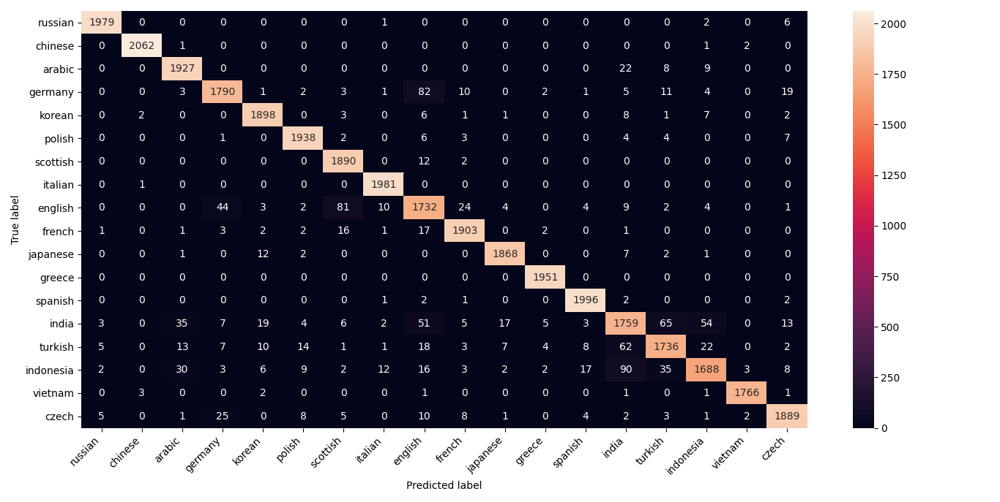

# Nationality Classify
This CNN model classified country based on person name.

# Avaliable Nationality
This model trained with [140317 names](./train.csv) from 18 nationality/ethnics:
- Russian
- China
- Arabic
- Dutch
- Korean
- Polish
- Scottish
- Italian
- UK
- France
- Japan
- Greece
- Spanish
- India
- Turkish
- Indonesia
- Vietnam
- Czech

# Result
For testing, we use 35080 mix names from available countries. Using `evaluation.py` we get 96.25% accuracy

# Confusion Matrix

# Demo
https://d4em0n.github.io/
